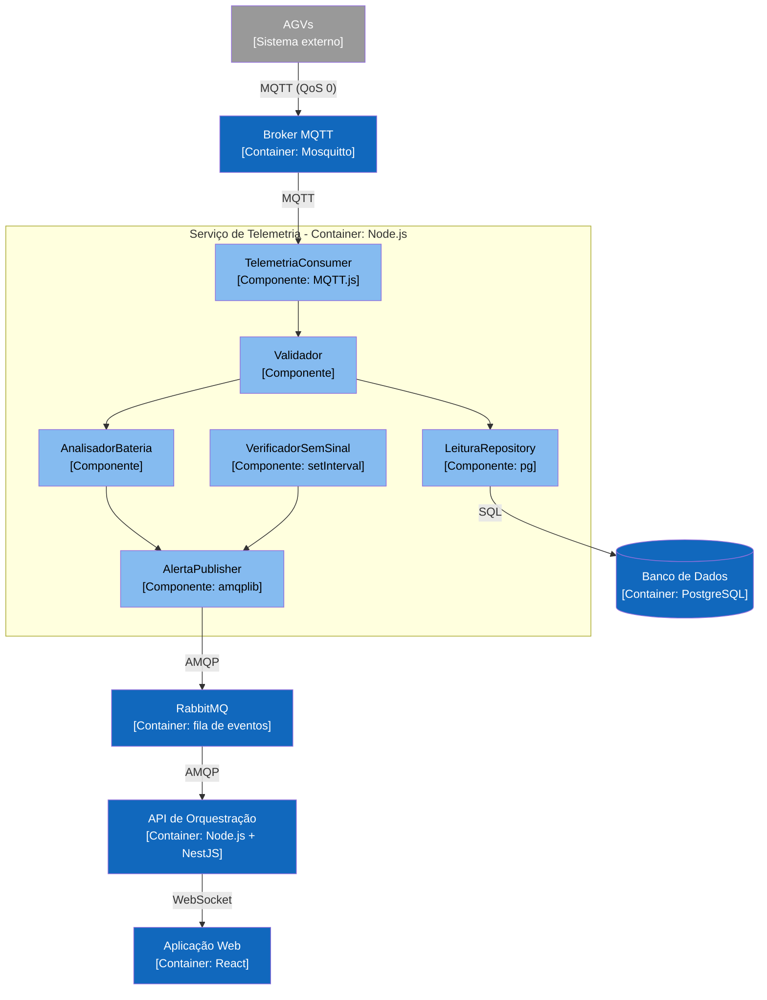

# C4 Nível 3 - Componentes do Serviço de Telemetria

```mermaid
flowchart TB
    agv["AGVs<br/>[Sistema externo]"]
    broker["Broker MQTT<br/>[Container: Mosquitto]"]

    subgraph tel[Serviço de Telemetria - Container: Node.js]
        consumer["TelemetriaConsumer<br/>[Componente: MQTT.js]"]
        validador["Validador<br/>[Componente]"]
        analisador["AnalisadorBateria<br/>[Componente]"]
        repo["LeituraRepository<br/>[Componente: pg]"]
        watchdog["VerificadorSemSinal<br/>[Componente: setInterval]"]
        pub["AlertaPublisher<br/>[Componente: amqplib]"]
    end

    bd[("Banco de Dados<br/>[Container: PostgreSQL]")]
    fila["RabbitMQ<br/>[Container: fila de eventos]"]
    api["API de Orquestração<br/>[Container: Node.js + NestJS]"]
    web["Aplicação Web<br/>[Container: React]"]

    agv -->|"MQTT (QoS 0)"| broker
    broker -->|MQTT| consumer
    consumer --> validador
    validador --> repo
    validador --> analisador
    analisador --> pub
    watchdog --> pub
    repo -->|SQL| bd
    pub -->|AMQP| fila
    fila -->|AMQP| api
    api -->|WebSocket| web

    classDef container fill:#1168bd,color:#fff
    classDef comp fill:#85bbf0,color:#000
    classDef ext fill:#999,color:#fff
    class broker,bd,fila,api,web container
    class consumer,validador,analisador,repo,watchdog,pub comp
    class agv ext
```
