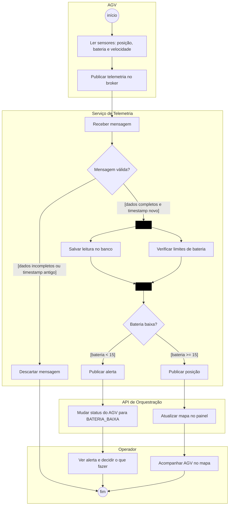

# Diagrama de Atividades - Telemetria

```mermaid
flowchart TB
    subgraph R1[AGV]
        I((início))
        A1[Ler sensores: posição, bateria e velocidade]
        A2[Publicar telemetria no broker]
    end

    subgraph R2[Serviço de Telemetria]
        B1[Receber mensagem]
        D1{Mensagem válida?}
        B2[Descartar mensagem]
        FORK[ ]:::barra
        B3[Salvar leitura no banco]
        B4[Verificar limites de bateria]
        JOIN[ ]:::barra
        D2{Bateria baixa?}
        B5[Publicar alerta]
        B6[Publicar posição]
    end

    subgraph R3[API de Orquestração]
        C1[Mudar status do AGV para BATERIA_BAIXA]
        C2[Atualizar mapa no painel]
    end

    subgraph R4[Operador]
        E1[Ver alerta e decidir o que fazer]
        E2[Acompanhar AGV no mapa]
        F((fim))
    end

    I --> A1 --> A2 --> B1 --> D1
    D1 -->|"[dados incompletos ou timestamp antigo]"| B2 --> F
    D1 -->|"[dados completos e timestamp novo]"| FORK
    FORK --> B3 --> JOIN
    FORK --> B4 --> JOIN
    JOIN --> D2
    D2 -->|"[bateria < 15]"| B5 --> C1 --> E1 --> F
    D2 -->|"[bateria >= 15]"| B6 --> C2 --> E2 --> F

    classDef barra fill:#000,stroke:#000,color:#000
```
