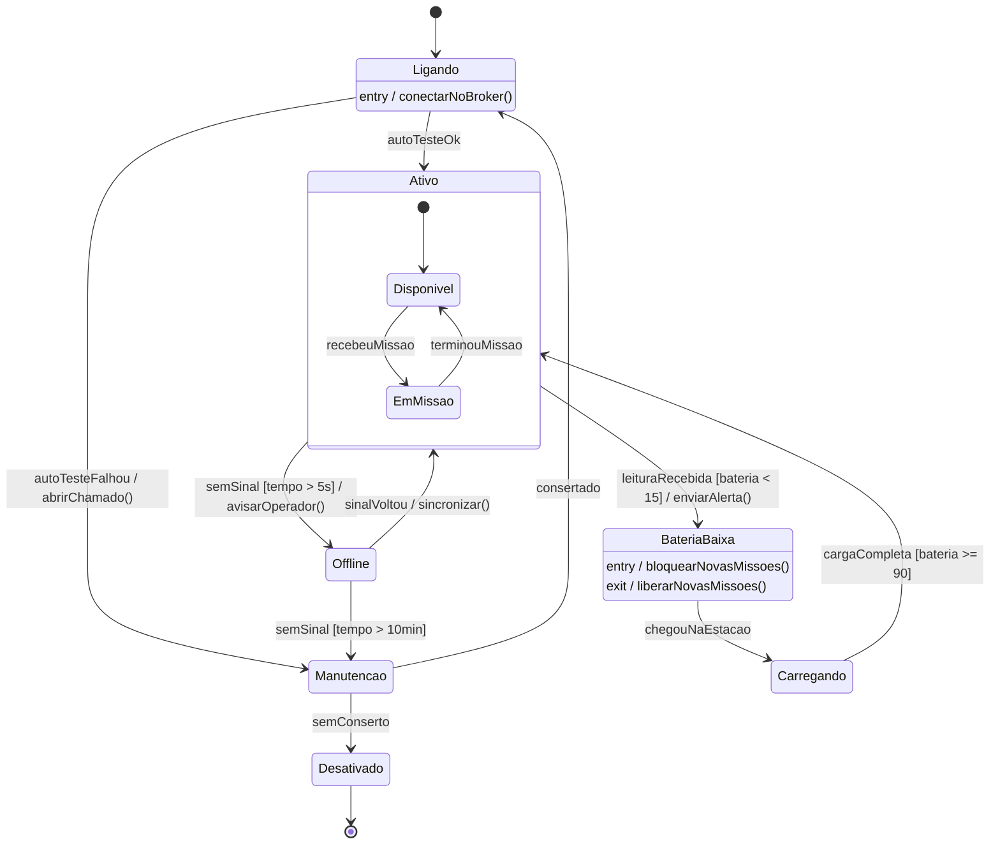

# Diagrama de Estados - VeiculoAGV

```mermaid
stateDiagram-v2
    [*] --> Ligando

    state "Ligando" as Ligando
    Ligando : entry / conectarNoBroker()

    Ligando --> Ativo : autoTesteOk
    Ligando --> Manutencao : autoTesteFalhou / abrirChamado()

    state Ativo {
        [*] --> Disponivel
        Disponivel --> EmMissao : recebeuMissao
        EmMissao --> Disponivel : terminouMissao
    }

    Ativo --> BateriaBaixa : leituraRecebida [bateria < 15] / enviarAlerta()

    state "BateriaBaixa" as BateriaBaixa
    BateriaBaixa : entry / bloquearNovasMissoes()
    BateriaBaixa : exit / liberarNovasMissoes()

    BateriaBaixa --> Carregando : chegouNaEstacao
    Carregando --> Ativo : cargaCompleta [bateria >= 90]

    Ativo --> Offline : semSinal [tempo > 5s] / avisarOperador()
    Offline --> Ativo : sinalVoltou / sincronizar()
    Offline --> Manutencao : semSinal [tempo > 10min]

    Manutencao --> Ligando : consertado
    Manutencao --> Desativado : semConserto
    Desativado --> [*]
```
