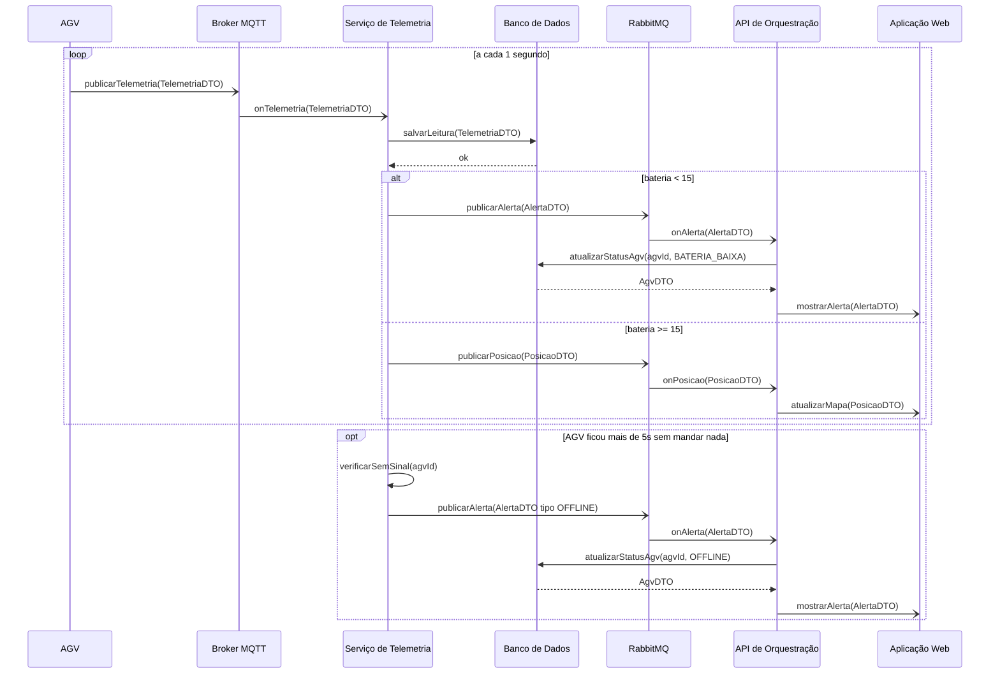

# Diagrama de Sequência - Telemetria dos AGVs

```mermaid
sequenceDiagram
    participant AGV
    participant Broker as Broker MQTT
    participant Tel as Serviço de Telemetria
    participant BD as Banco de Dados
    participant Fila as RabbitMQ
    participant API as API de Orquestração
    participant Web as Aplicação Web

    loop a cada 1 segundo
        AGV-)Broker: publicarTelemetria(TelemetriaDTO)
        Broker-)Tel: onTelemetria(TelemetriaDTO)
        Tel->>BD: salvarLeitura(TelemetriaDTO)
        BD-->>Tel: ok

        alt bateria < 15
            Tel-)Fila: publicarAlerta(AlertaDTO)
            Fila-)API: onAlerta(AlertaDTO)
            API->>BD: atualizarStatusAgv(agvId, BATERIA_BAIXA)
            BD-->>API: AgvDTO
            API-)Web: mostrarAlerta(AlertaDTO)
        else bateria >= 15
            Tel-)Fila: publicarPosicao(PosicaoDTO)
            Fila-)API: onPosicao(PosicaoDTO)
            API-)Web: atualizarMapa(PosicaoDTO)
        end
    end

    opt AGV ficou mais de 5s sem mandar nada
        Tel->>Tel: verificarSemSinal(agvId)
        Tel-)Fila: publicarAlerta(AlertaDTO tipo OFFLINE)
        Fila-)API: onAlerta(AlertaDTO)
        API->>BD: atualizarStatusAgv(agvId, OFFLINE)
        BD-->>API: AgvDTO
        API-)Web: mostrarAlerta(AlertaDTO)
    end
```
